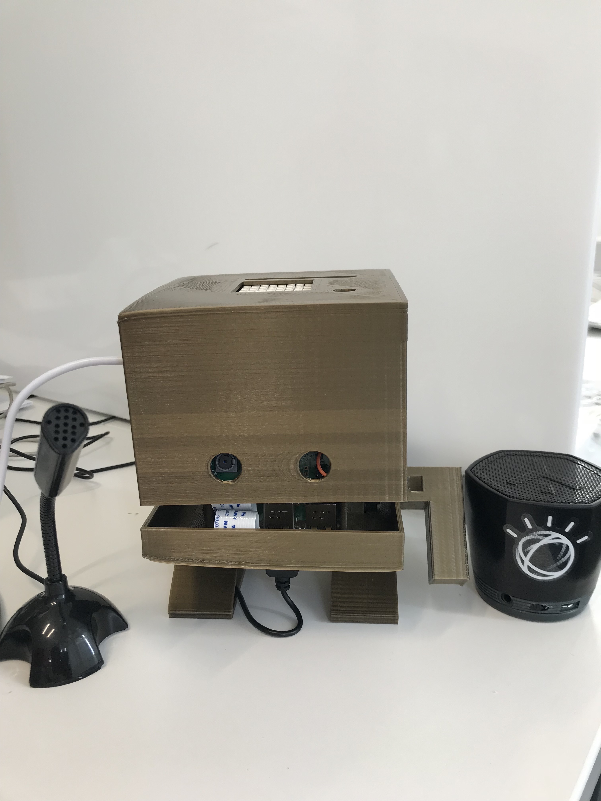

# TJBOT: Intro

Import this json file to your Node-RED to get started using IBM Watson API on your TJBot !
On this version, you will need to connect a Sensehat to your TJBot like it's been done by Brian Innes at https://github.com/binnes/tobyjnr/wiki